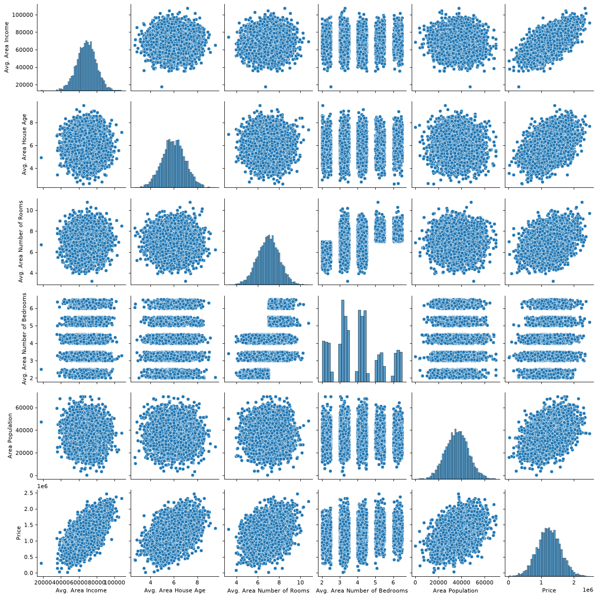
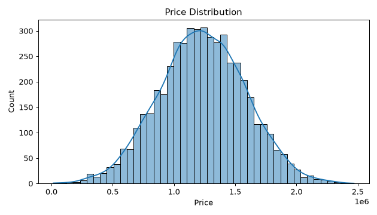
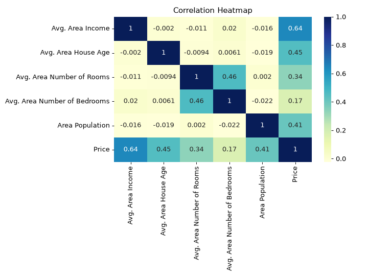
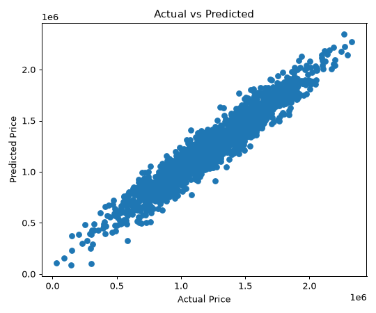
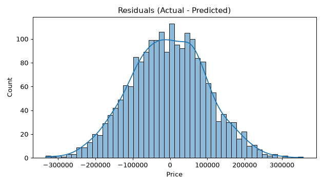

# 📘 Day 5 — Linear Regression: Full Code + Output + Guide (README)

**Kaj:** `USA_Housing.csv` diye house **Price** (continuous number) predict kora. Supervised · Regression.
Ei README te: **first-to-last step**, protita code, **real expected output** (plot image soho), ar **error fix** — sob ache. Line dhore follow koro.

> ✅ Ei README-r sob output **actual run kore capture kora** — tumi same code chalale eki result pabe (`random_state=101` bola ache).

---

## 🟢 STEP 0 — Setup (age ekbar)

Ei folder e ache: `day-05__USA_Housing.csv` (dataset), `Practice_Day-05_Linear-Regression.ipynb` (ready notebook), ei `README.md`, ar `outputs/` (plot gula).

**Chalanor 2 ta upay:**

**(A) Jupyter Notebook e (recommended):**
```bash
cd "/home/technonext/AA__ROOT/Hon_4.2_semester/!! ICT 4202 AI Lab/LAB-FINAL-2"
bash start-jupyter.sh
```
→ Chrome e khulbe → `Day-05_Linear-Regression/Practice_Day-05_Linear-Regression.ipynb` open koro → kernel **"Python (LAB-FINAL-2)"** select → **Run → Run All Cells**.

**(B) Direct python script hisebe:** niche-r sob code ekta `.py` te bosiye `./.venv/bin/python file.py`.

> ⚙️ **Kernel joruri:** notun notebook e upore-daane **"Python (LAB-FINAL-2)"** select korte hobe, na hole `pandas` import fail korbe.

---

## 1️⃣ Import libraries
```python
import pandas as pd
import numpy as np
import matplotlib.pyplot as plt
import seaborn as sns
%matplotlib inline
```
**Ki kore:** dorkari library load. `%matplotlib inline` → plot notebook-er vitore dekhabe.
**Output:** kono output nei (shudhu load hoy).

---

## 2️⃣ Data pora o dekha (`head`)
```python
USAhousing = pd.read_csv('day-05__USA_Housing.csv')
USAhousing.head()
```
**Ki kore:** CSV load kore prothom 5 row dekhay.
**Expected output** (Address column-ta chhoto kore dekhano holo):
```
   Avg. Area Income  Avg. Area House Age  Avg. Area Number of Rooms  Avg. Area Number of Bedrooms  Area Population         Price
0      79545.458574             5.682861                   7.009188                          4.09     23086.800503  1.059034e+06
1      79248.642455             6.002900                   6.730821                          3.09     40173.072174  1.505891e+06
2      61287.067179             5.865890                   8.512727                          5.13     36882.159400  1.058988e+06
3      63345.240046             7.188236                   5.586729                          3.26     34310.242831  1.260617e+06
4      59982.197226             5.040555                   7.839388                          4.23     26354.109472  6.309435e+05
```
(+ ekta `Address` text column ache — oita pore drop korbo.)

---

## 3️⃣ Data-r summary (`info`)
```python
USAhousing.info()
```
**Ki kore:** koyta row/column, koyta non-null, kon type.
**Expected output:**
```
<class 'pandas.DataFrame'>
RangeIndex: 5000 entries, 0 to 4999
Data columns (total 7 columns):
 #   Column                        Non-Null Count  Dtype
---  ------                        --------------  -----
 0   Avg. Area Income              5000 non-null   float64
 1   Avg. Area House Age           5000 non-null   float64
 2   Avg. Area Number of Rooms     5000 non-null   float64
 3   Avg. Area Number of Bedrooms  5000 non-null   float64
 4   Area Population               5000 non-null   float64
 5   Price                         5000 non-null   float64
 6   Address                       5000 non-null   str
dtypes: float64(6), str(1)
```
🧠 **5000 row, kono missing nei** (sob non-null). 6 ta number column + 1 ta text (Address).

---

## 4️⃣ Statistics (`describe`)
```python
USAhousing.describe()
```
**Ki kore:** mean, std, min, max, quartile.
**Expected output** (main jinis): Price-er **mean ≈ 12,32,073** (~12 lakh), min ~16k, max ~24 lakh. Income-er mean ≈ 68,583.

---

## 5️⃣ Column list
```python
USAhousing.columns
```
**Expected output:**
```
['Avg. Area Income', 'Avg. Area House Age', 'Avg. Area Number of Rooms',
 'Avg. Area Number of Bedrooms', 'Area Population', 'Price', 'Address']
```

---

## 6️⃣ EDA — Pairplot
```python
sns.pairplot(USAhousing)   # ektu somoy nite pare (5000 row)
```
**Ki kore:** protita feature-er sathe onno feature-er relation (scatter) + nijer distribution.
**Expected output:** ekta boro grid of scatter plots —



---

## 7️⃣ Price-er distribution
```python
# ⚠️ Lab-e chilo: sns.distplot(USAhousing['Price'])
# notun seaborn-e distplot NEI -> histplot use kori (same kaj):
sns.histplot(USAhousing['Price'], kde=True)
```
**Ki kore:** Price kemon distribute (bell-shape/normal ki na).
**Expected output:** ekta bell-shape (normal-er moto) curve, center ~12 lakh —



---

## 8️⃣ Correlation heatmap
```python
# ⚠️ Lab-e chilo: sns.heatmap(USAhousing.corr(), annot=True)
# notun pandas-e text column-er jonno corr() error dey -> numeric_only=True lage:
sns.heatmap(USAhousing.corr(numeric_only=True), annot=True, cmap="YlGnBu")
```
**Ki kore:** kon feature Price-er sathe koto related (−1 theke +1).
**Expected output** (number gula):
```
Price er sathe correlation:
  Avg. Area Income            0.6397   <- sob theke beshi
  Avg. Area House Age         0.4525
  Area Population             0.4086
  Avg. Area Number of Rooms   0.3357
  Avg. Area Number of Bedrooms 0.1711  <- sob theke kom
```


🧠 **Avg. Area Income** Price-er sathe sob theke beshi correlated (0.64).

---

## 9️⃣ X (features) o y (target) banano
```python
X = USAhousing[['Avg. Area Income','Avg. Area House Age','Avg. Area Number of Rooms',
                'Avg. Area Number of Bedrooms','Area Population']]
y = USAhousing['Price']
```
**Ki kore:** `X` = 5 ta number feature. `y` = Price (target). `Address` (text) baad — model number chai.
**Output:** nei.

---

## 🔟 Train / Test split
```python
from sklearn.model_selection import train_test_split
X_train, X_test, y_train, y_test = train_test_split(X, y, test_size=0.4, random_state=101)
```
**Ki kore:** data 60% train / 40% test e bhag. `random_state=101` → proti baar eki split (result mele).
**Output:** nei.

---

## 1️⃣1️⃣ Model train (fit)
```python
from sklearn.linear_model import LinearRegression
lm = LinearRegression()
lm.fit(X_train, y_train)
```
**Ki kore:** Least Squares diye best-fit line boshay (train data theke shekhe).
**Expected output:** `LinearRegression()` (fitted model object).

---

## 1️⃣2️⃣ Coefficients o intercept
```python
print('Intercept:', lm.intercept_)
coeff_df = pd.DataFrame(lm.coef_, X.columns, columns=['Coefficient'])
coeff_df
```
**Ki kore:** intercept = base value; coefficient = feature 1 unit barle Price koto bare.
**Expected output:**
```
Intercept: -2640159.7968526953

                                Coefficient
Avg. Area Income                  21.528276
Avg. Area House Age           164883.282027
Avg. Area Number of Rooms     122368.678027
Avg. Area Number of Bedrooms    2233.801864
Area Population                   15.150420
```
🧠 Jemon: `Avg. Area Income` 1 barle Price ~**$21.5** bare (baki sob same rekhe).

---

## 1️⃣3️⃣ Predictions + Actual vs Predicted plot
```python
predictions = lm.predict(X_test)
plt.scatter(y_test, predictions)
plt.xlabel('Actual Price'); plt.ylabel('Predicted Price')
```
**Ki kore:** test data-r Price predict kore, actual-er sathe compare.
**Expected output:** point gula prai ekta **straight line** e — mane prediction bhalo.
```
predictions[:5] = [1260960.71,  827588.76, 1742421.24,  974625.39,  998717.84]
```


---

## 1️⃣4️⃣ Residuals (error) distribution
```python
# Lab-e sns.distplot; notun version-e histplot:
sns.histplot((y_test - predictions), bins=50, kde=True)
```
**Ki kore:** residual = actual − predicted. Normal (bell-shape) hole model thik.
**Expected output:** 0-er charpashe bell-shape —



---

## 1️⃣5️⃣ Regression Metrics (asol evaluation)
```python
from sklearn import metrics
print('MAE :', metrics.mean_absolute_error(y_test, predictions))
print('MSE :', metrics.mean_squared_error(y_test, predictions))
print('RMSE:', np.sqrt(metrics.mean_squared_error(y_test, predictions)))
print('R2  :', metrics.r2_score(y_test, predictions))
```
**Expected output:**
```
MAE : 82288.22251914942
MSE : 10460958907.208977
RMSE: 102278.82922290897
R2  : 0.9176824009649241
```
**Mane ki:**
| Metric | Value | Bujhbe kivabe |
|---|---|---|
| **MAE** | ~82,288 | gore ~82k dollar bhul (soja average error) |
| **MSE** | ~1.046e10 | error² er gor (boro number, boro error penalize) |
| **RMSE** | ~1,02,279 | dollar-er same unit e ~1 lakh bhul (interpret sohoj) |
| **R²** | **0.918** | model Price-er **~92% variation** explain kore → **khub bhalo fit** ✅ |

> MAE/MSE/RMSE **loss** → kom hole bhalo. R² → beshi (1-er kache) hole bhalo.

---

## 🐞 Errors & Fixes (jegulo pete paro)

| Error | Keno | Fix |
|---|---|---|
| `AttributeError: module 'seaborn' has no attribute 'distplot'` | notun seaborn (0.14+) e `distplot` remove kora | `sns.histplot(...)` ba `sns.displot(...)` use koro |
| `ValueError: could not convert string to float: '208 Michael...'` (corr/heatmap e) | `Address` text column-er upor `corr()` cholte pare na | `USAhousing.corr(numeric_only=True)` |
| `FileNotFoundError: day-05__USA_Housing.csv` | notebook onno folder theke chalachcho | notebook-ta `Day-05_Linear-Regression/` folder-er vitorei rakho (CSV oikhane) |
| `ModuleNotFoundError: No module named 'pandas'` | bhul kernel select kora | kernel **"Python (LAB-FINAL-2)"** select koro |
| `NameError: name 'X_train' is not defined` | upor-er cell run koro nai | **Run All Cells** — upor theke niche kramanvaye |

> 🧠 **Rule:** cell gula **upor theke niche kramanvaye** run korte hobe (agera train_test_split, tarpor fit).

---

## 🏁 One-page recap (exam-er age)
```python
# 1. import: pandas, numpy, matplotlib, seaborn
# 2. df = pd.read_csv('day-05__USA_Housing.csv')
# 3. X = 5 feature ; y = df['Price']   (Address baad)
# 4. train_test_split(X, y, test_size=0.4, random_state=101)
# 5. lm = LinearRegression(); lm.fit(X_train, y_train)
# 6. predictions = lm.predict(X_test)
# 7. metrics: MAE / MSE / RMSE / R2
```
Ei 7 step-i Day 5-er puro code. Baki din-e shudhu step 5-er **model line** ar step 7-er **metric** palte. 💪
