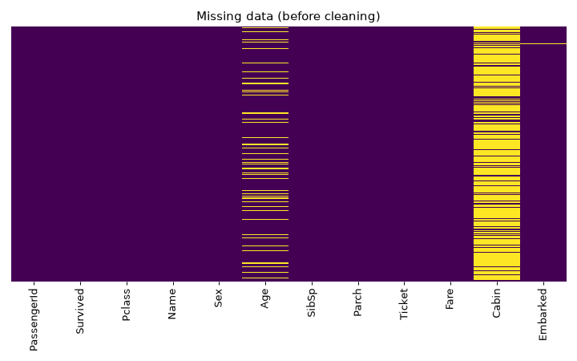
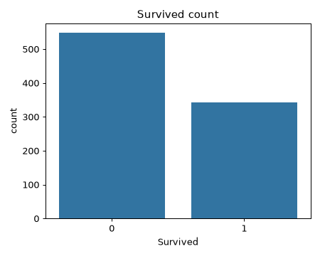
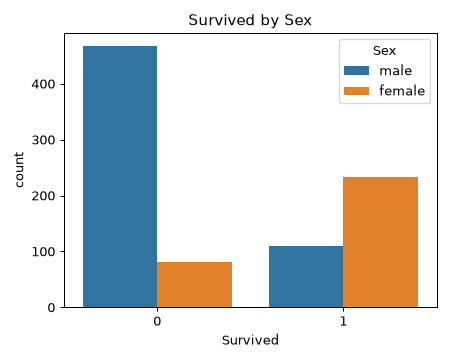
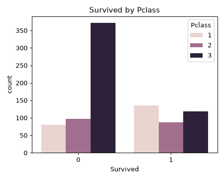
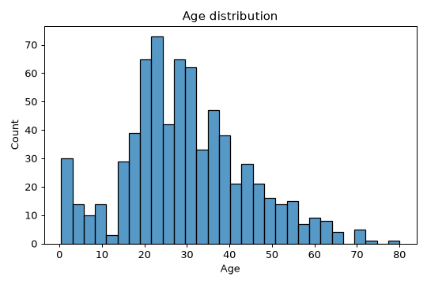
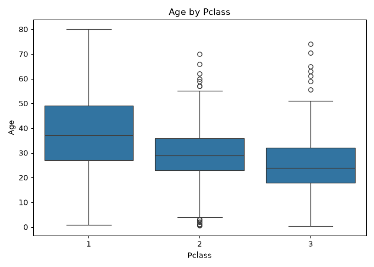
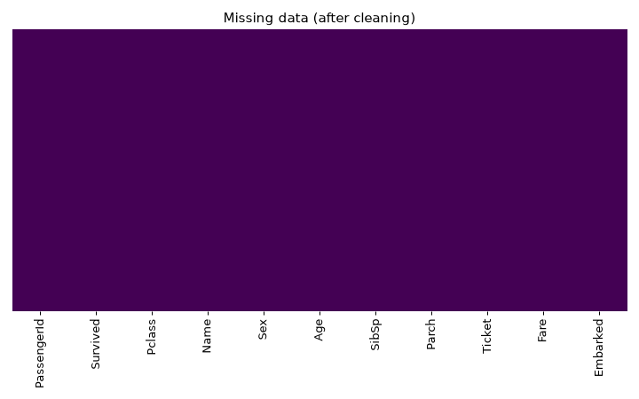
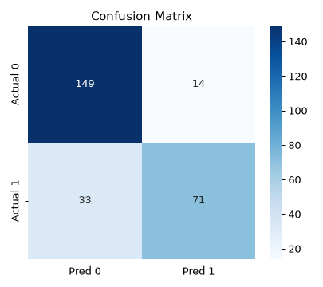

# 📘 Day 6 — Logistic Regression: Full Code + Output + Guide (README)

**Kaj:** `titanic_train.csv` diye passenger **Survived** (0 = mara geche, 1 = beche geche) predict kora. Supervised · **Classification**.
Ei README te: **first-to-last step**, protita code, **real expected output** (plot image soho), ar **error fix**.

> ✅ Sob output **actual run kore capture kora** — tumi same code chalale eki result pabe (`random_state=101`).
> 🔑 **Day 5-er sathe parthokko:** Day 5 = number (Price) predict = **Regression**; Day 6 = category (0/1) predict = **Classification**. Skeleton same, shudhu **model** (`LogisticRegression`) ar **metric** (confusion matrix) palte.

---

## 🟢 STEP 0 — Setup

Folder e ache: `titanic_train.csv`, `Practice_Day-06_Logistic-Regression.ipynb`, ei `README.md`, `outputs/` (plot).

```bash
cd "/home/technonext/AA__ROOT/Hon_4.2_semester/!! ICT 4202 AI Lab/LAB-FINAL-2"
bash start-jupyter.sh
```
→ Chrome e → `Day-06_Logistic-Regression/Practice_Day-06_Logistic-Regression.ipynb` → kernel **"Python (LAB-FINAL-2)"** → **Run → Run All Cells**.

---

## 1️⃣ Import libraries
```python
import pandas as pd
import numpy as np
import matplotlib.pyplot as plt
import seaborn as sns
%matplotlib inline
```
**Output:** nei (shudhu load).

---

## 2️⃣ Data pora
```python
train = pd.read_csv('titanic_train.csv')
train.head()
```
**Ki kore:** Titanic data load kore prothom 5 row dekhay.
**Expected output:** 12 column — `PassengerId, Survived, Pclass, Name, Sex, Age, SibSp, Parch, Ticket, Fare, Cabin, Embarked`.
- `Survived` = target (0/1). `Sex`, `Embarked` = text. `Age`, `Cabin`, `Embarked` e missing (NaN) ache.

---

## 3️⃣ EDA — missing data + pattern

```python
sns.heatmap(train.isnull(), yticklabels=False, cbar=False, cmap='viridis')
```
**Ki kore:** kothaj missing (holud dag = NaN).
**Expected output:** `Age`-e onek holud dag, `Cabin`-e prai puro holud —



`train.isnull().sum()` dile exact number:
```
Age         177   <- fill korbo (impute)
Cabin       687   <- eto missing -> puro column DROP korbo
Embarked      2   <- ei 2 row drop korbo
```

Aro EDA (kara beche gelo):
```python
sns.countplot(x='Survived', data=train)              # koto morlo vs bachlo
sns.countplot(x='Survived', hue='Sex', data=train)   # male beshi mara geche
sns.countplot(x='Survived', hue='Pclass', data=train)# class 3 e death beshi
sns.histplot(train['Age'].dropna(), bins=30)         # age distribution
```
| | |
|---|---|
|  |  |
|  |  |

🧠 **Dekha jay:** meye-der (female) bachar haar onek beshi; class 1-er bachar haar beshi. Egula model-er kaje lagbe.

---

## 4️⃣ Data Cleaning (ei day-er ASOL part)

**(a) Age missing → Pclass onujayi boshai** (boxplot e dekha jay boro class = boshi boyoshi):
```python
sns.boxplot(x='Pclass', y='Age', data=train)
```


```python
def impute_age(cols):
    Age = cols.iloc[0]; Pclass = cols.iloc[1]
    if pd.isnull(Age):
        if Pclass == 1: return 37
        elif Pclass == 2: return 29
        else: return 24
    else:
        return Age

train['Age'] = train[['Age','Pclass']].apply(impute_age, axis=1)
```
> **Mane:** Age NaN hole — class 1 → 37, class 2 → 29, class 3 → 24 boshai (ei maan gula boxplot-er median theke newa).

**(b) Cabin drop + baki NaN row drop:**
```python
train.drop('Cabin', axis=1, inplace=True)   # eto missing -> puro column baad
train.dropna(inplace=True)                  # baki NaN row (Embarked 2 ta) baad
sns.heatmap(train.isnull(), yticklabels=False, cbar=False, cmap='viridis')  # ekhon clean
```
**Expected output:** ekhon puro kalo (kono holud nei = kono missing nei) —



---

## 5️⃣ Categorical → dummy variables (number banano)
```python
sex = pd.get_dummies(train['Sex'], drop_first=True)        # -> 'male' column
embark = pd.get_dummies(train['Embarked'], drop_first=True)# -> 'Q','S' column
train.drop(['Sex','Embarked','Name','Ticket'], axis=1, inplace=True)
train = pd.concat([train, sex, embark], axis=1)
train.head()
```
**Ki kore:** text (Sex, Embarked) ke **0/1** column-e vange (model number chai).
- `drop_first=True` → ekta column bad (**dummy variable trap / multicollinearity** edaj). Sex → shudhu `male` (male=1, female=0).
- `Name`, `Ticket` — useless text, drop.

**Expected output:** ekhon sob number/bool column —
```
   PassengerId  Survived  Pclass   Age  SibSp  Parch     Fare   male      Q      S
0            1         0       3  22.0      1      0   7.2500   True  False   True
1            2         1       1  38.0      1      0  71.2833  False  False  False
```
> 🔎 `True/False` mane-i **1/0** (notun pandas bool hisebe dekhay) — model-er kache same.

---

## 6️⃣ Train / Test split
```python
from sklearn.model_selection import train_test_split
X_train, X_test, y_train, y_test = train_test_split(
    train.drop('Survived', axis=1), train['Survived'],
    test_size=0.30, random_state=101)
```
**Ki kore:** `X` = Survived chhada baki sob column; `y` = Survived. 70% train / 30% test.
**Output:** nei.

---

## 7️⃣ Model train + predict
```python
from sklearn.linear_model import LogisticRegression
logmodel = LogisticRegression(solver='lbfgs', max_iter=1000)
logmodel.fit(X_train, y_train)
predictions = logmodel.predict(X_test)
```
**Ki kore:** Logistic Regression train kore, tarpor test data-r 0/1 predict kore.
- `solver='lbfgs'` = optimization algorithm; `max_iter=1000` = beshi iteration (jate converge kore).
**Output:** `LogisticRegression(max_iter=1000)` (fitted model).

---

## 8️⃣ Evaluation — Classification metrics

```python
from sklearn.metrics import classification_report, confusion_matrix
print(classification_report(y_test, predictions))
print(confusion_matrix(y_test, predictions))
```
**Expected output:**
```
              precision    recall  f1-score   support
           0       0.82      0.91      0.86       163
           1       0.84      0.68      0.75       104
    accuracy                           0.82       267

confusion_matrix:
[[149  14]
 [ 33  71]]
```

**🔢 Confusion matrix pdar niyom** — layout `[[TN, FP], [FN, TP]]`:

|  | Predicted 0 | Predicted 1 |
|---|---|---|
| **Actual 0** | **149** (TN ✅) | 14 (FP ❌) |
| **Actual 1** | 33 (FN ❌) | **71** (TP ✅) |



- **TN=149:** moreche, model-o boleche moreche ✅
- **FP=14:** moreche, kintu model boleche beche geche ❌
- **FN=33:** beche geche, kintu model boleche moreche ❌ (survivor miss)
- **TP=71:** beche geche, model-o thik boleche ✅

```python
from sklearn.metrics import accuracy_score, precision_score, recall_score, f1_score
# accuracy  = 0.8240   -> (TN+TP)/total = (149+71)/267
# precision = 0.8353   -> TP/(TP+FP) = 71/85
# recall    = 0.6827   -> TP/(TP+FN) = 71/104
# f1        = 0.7513   -> precision & recall er harmonic mean
```
**Mane ki:**
| Metric | Value | Bujhbe kivabe |
|---|---|---|
| **Accuracy** | 0.82 | mot 82% prediction thik |
| **Precision** | 0.84 | "beche geche" bola gula-r 84% shotti beche giyechilo |
| **Recall** | 0.68 | asol survivor-der 68% ke model dhorte pereche |
| **F1** | 0.75 | precision+recall er balance |

> 🧠 **Regression-er MAE/RMSE ekhane use HOY NA** — eta classification, tai accuracy/precision/recall/F1 + confusion matrix.

---

## 🐞 Errors & Fixes

| Error | Fix |
|---|---|
| `could not convert string to float: 'male'` | Sex/Embarked ke `get_dummies` diye number koro (Step 5) |
| `ValueError: Input contains NaN` | age impute + `dropna` koro nai (Step 4) |
| `ConvergenceWarning: lbfgs failed to converge` | warning matro (result thik); `max_iter=1000` diyei ache |
| `KeyError: 'Age'` | `apply(impute_age)`-e `cols.iloc[0]` use koro (index diye) |
| `No module named` / `NameError` | kernel "Python (LAB-FINAL-2)" + **Run All Cells** upor theke |

---

## 🏁 One-page recap
```python
# 1. read_csv('titanic_train.csv')
# 2. cleaning: impute_age (Pclass onujayi) -> drop Cabin -> dropna
# 3. get_dummies(Sex, Embarked, drop_first=True) -> drop text -> concat
# 4. X = train.drop('Survived') ; y = train['Survived']
# 5. train_test_split(test_size=0.30, random_state=101)
# 6. LogisticRegression(solver='lbfgs', max_iter=1000).fit(...)
# 7. classification_report + confusion_matrix
```
Day 5-er sathe **shudhu 2 ta parthokko:** model = **LogisticRegression** (Linear noy), metric = **classification_report/confusion_matrix** (MAE/RMSE noy). Ar ei day-e ekta **cleaning + dummy** dhap beshi.
